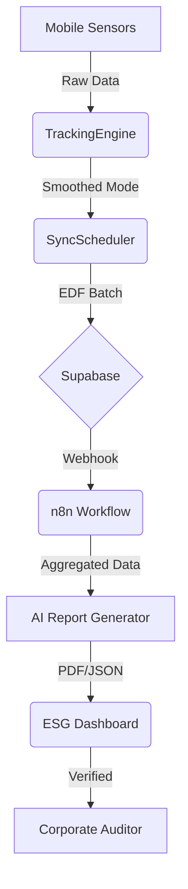

# EcoTrack Enterprise | System Architecture & Documentation
## 🌍 AI-Driven Passive Carbon Auditing & ESG Compliance

### 1. Project Purpose
EcoTrack Enterprise is a B2B SaaS platform designed for high-resolution, passive carbon auditing. It transforms raw mobile sensor data into investment-grade ESG (Environmental, Social, and Governance) reports, enabling corporations to meet legal compliance standards (CSRD/SEC) with zero manual data entry from employees.

---

### 2. High-Level Architecture
The system is divided into four distinct layers:

| Layer | Responsibility | Technology Stack |
| :--- | :--- | :--- |
| **Mobile Agent** | Sensor fusion, on-device ML, and tracking | Native Kotlin (Android API 34) |
| **Management UI** | ESG Dashboards and Auditor visualization | Flutter (Dart) |
| **Cloud Backend** | Multi-tenant storage and JWT Auth | Supabase (PostgreSQL) |
| **Automation Engine** | Report generation and AI synthesis | n8n Workflow Engine |

---

### 3. Core Modules

#### 3.1 TrackingEngine (Kotlin)
- **Algorithm**: Streaming Sliding Window with Amortized O(1) Majority Vote.
- **Purpose**: Cleans noisy GPS/Accel data into discrete transport modes.
- **Header**: Includes formal DAA complexity proofs ($O(1)$ updates).

#### 3.2 EcoRouteOptimizer (Kotlin)
- **Algorithm**: Multi-criteria A* Search.
- **Purpose**: Computes paths that minimize $W(e) = \alpha \cdot dist + \beta \cdot traffic + \gamma \cdot emissions$.
- **Utility**: Provides the "Top-3" most eco-efficient routes for fleet logistics.

#### 3.3 SyncSchedulerService (Kotlin)
- **Algorithm**: Earliest-Deadline-First (EDF) Greedy Strategy.
- **Conflict Resolution**: Vector Clocks for causal ordering.
- **Purpose**: Optimizes battery life by batching uploads during WiFi windows or critical deadlines.

#### 3.4 Algorithmics Dashboard (Flutter)
- **Style**: Glassmorphic UI with real-time MethodChannel streams.
- **Purpose**: Provides "Auditor Transparency" into the underlying algorithmic veracity.

---

### 4. n8n Automation Workflow
The n8n layer handles the "Compliance-as-a-Service" logic by reacting to data changes in Supabase.

**Workflow Logic (`ecotrack_esg_workflow.json`):**
1. **Supabase Webhook**: Triggers when a new sync packet or month-end event occurs.
2. **Query Emissions**: Aggregates `transport_activities` for the specific `companyId`.
3. **Carbon Offset Calculator**: Computes net emissions and required offset credits.
4. **AI Report Node**: (See Image) Uses an LLM to generate an executive summary.
5. **Discord/Notification**: Dispatches the final report to the enterprise auditor.

#### 🔧 How to Test n8n
To verify the automation pipeline without waiting for live device data:

1. **Mock Webhook Trigger**: 
   - Open the n8n editor and copy the **Test Webhook URL**.
   - Use `curl` or Postman to send a mock payload:
     ```bash
     curl -X POST <YOUR_N8N_URL>/supabase-activity-trigger \
     -H "Content-Type: application/json" \
     -d '{"companyId": "comp_alpha_99", "id": "test-uuid-123"}'
     ```
2. **Execute Node-by-Node**:
   - Use the "Execute Node" button in n8n to inspect the transformation at the **Carbon Offset Calculator**.
   - Verify that the `netCo2Kg` is calculated correctly based on the aggregated data.
3. **Verify Sink**:
   - Check the `sustainability_reports` table in the Supabase Dashboard to ensure the record was inserted.
   - Confirm receipt of the report in the linked Discord channel or HTTP endpoint.

---

### 5. Data Flow Diagram (Conceptual)


### 6. Academic References
- **CLRS 4th Ed.**: A* Search Admissibility and Heuristics.
- **Horn (1974)**: EDF Optimality for meeting task deadlines.
- **Lamport (1978)**: Vector Clocks and Logical Clock consistency.
